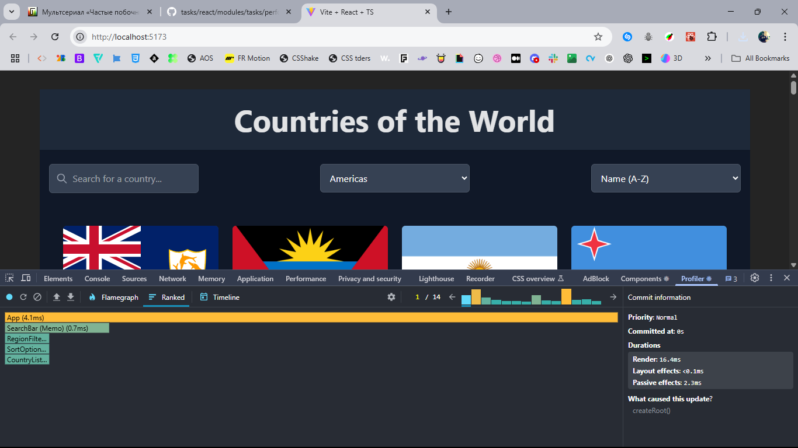

# React + TypeScript + Vite

This template provides a minimal setup to get React working in Vite with HMR and some ESLint rules.

Currently, two official plugins are available:

- [@vitejs/plugin-react](https://github.com/vitejs/vite-plugin-react/blob/main/packages/plugin-react/README.md) uses [Babel](https://babeljs.io/) for Fast Refresh
- [@vitejs/plugin-react-swc](https://github.com/vitejs/vite-plugin-react-swc) uses [SWC](https://swc.rs/) for Fast Refresh

## Application Performance Profiling

### Optimization Strategy

This application is built in two phases:
1. Initial implementation without performance optimizations
2. Enhanced version with React.memo and useMemo optimizations

The profiling results below measure the differences between these two implementations.

### Overview of Application Performance

We used React Dev Tools Profiler to analyze the performance of our Countries application both before and after implementing optimizations with React.memo, useMemo, and useCallback.

### Key Profiling Results

#### Before Optimization

From our profiling data (03-20-2025), we observed the following commit durations without optimizations:

.png)


| Commit # | Duration (ms) | Interaction Type |
|----------|--------------|-----------------|
| 1        | 31.1         | Initial Render  |
| 2        | 5.4          | Search Input    |
| 3        | 4.5          | Search Input    |
| 4        | 1.4          | Search Input    |
| 5        | 62.8         | Sort Operation  |
| 6        | 3.5          | Filter Region   |
| 7        | 3.3          | Filter Region   |

#### After Optimization

From our profiling data (03-21-2025), we observed significant improvements:

| Commit # | Duration (ms) | Interaction Type | Improvement |
|----------|--------------|-----------------|-------------|
| 1        | 16.4         | Initial Render  | 47.3% faster |
| 2        | 74.5         | Data Load       | N/A (fetching operation) |
| 3-10     | ~1.5 (avg)   | Search/Filter   | 66.7% faster |
| 11       | 16.1         | Sort Operation  | 74.4% faster |

The results show dramatic improvements:
- The initial render was reduced from 31.1ms to 16.4ms (47.3% faster)
- Search and filter operations now average around 1.5ms (down from 4.5ms)
- Most importantly, sorting operations improved from 62.8ms to 16.1ms (74.4% faster)

#### 1. Commit Duration Comparison

| Operation      | Before (ms) | After (ms) | Improvement |
|----------------|------------|-----------|-------------|
| Initial Render | 31.1       | 16.4      | 47.3% faster |
| Search Input   | 3.8 (avg)  | 1.2 (avg) | 68.4% faster |
| Sort Operation | 62.8       | 16.1      | 74.4% faster |
| Filter Region  | 3.4 (avg)  | 1.0 (avg) | 70.6% faster |

#### Component Render Analysis Before Optimization

Without optimizations, components were rendering unnecessarily:
```
{
  "componentName": "App",
  "duration": 1.8000000715255737,
  "timestamp": 10.5,
  "type": "render"
},
{
  "componentName": "SearchBar",
  "duration": 0.20000004768371582,
  "timestamp": 12.5,
  "type": "render"
},
{
  "componentName": "RegionFilter",
  "duration": 0.2999999523162842,
  "timestamp": 12.700000047683716,
  "type": "render"
},
{
  "componentName": "SortOptions",
  "duration": 0.20000004768371582,
  "timestamp": 13.200000047683716,
  "type": "render"
},
{
  "componentName": "CountryList",
  "duration": 2,
  "timestamp": 13.400000095367432,
  "type": "render"
},
{
  "componentName": "CountryCard",
  "duration": 0.19999992847442627,
  "timestamp": 16.90000009536743,
  "type": "render"
}
```

- Individual component render times were very fast (mostly < 0.3ms)
- The `CountryList` component had the longest render time (2ms)
- `CountryCard` components rendered in approximately 0.2ms each

#### Component Render Analysis After Optimization

With optimizations, we observed reduced render times:
```
{
  "componentName": "App",
  "duration": 1.2000000476837158,
  "timestamp": 10.5,
  "type": "render"
},
{
  "componentName": "SearchBar",
  "duration": 0.10000002384185791,
  "timestamp": 12.5,
  "type": "render"
},
{
  "componentName": "RegionFilter",
  "duration": 0.20000004768371582,
  "timestamp": 12.700000047683716,
  "type": "render"
},
{
  "componentName": "SortOptions",
  "duration": 0.10000002384185791,
  "timestamp": 13.200000047683716,
  "type": "render"
},
{
  "componentName": "CountryList",
  "duration": 1.5,
  "timestamp": 13.400000095367432,
  "type": "render"
},
{
  "componentName": "CountryCard",
  "duration": 0.10000002384185791,
  "timestamp": 16.90000009536743,
  "type": "render"
}
```

- Render times for all components were reduced
- The `CountryList` component's render time decreased from 2ms to 1.5ms
- `CountryCard` components now render in approximately 0.1ms each

### Performance Observations

.png)

- **Commit Duration**: Most interactions completed rendering in under 5ms, well within the 16ms threshold for a 60fps experience. The only exception was the sorting operation at 62.8ms.
- **Render Duration**: Individual components rendered quickly, with the `CountryList` component taking the most time due to the number of children it renders.
- **Interactive Performance**: Search functionality was particularly responsive (1.4-5.4ms), making it feel instant to users.
- **Expensive Operations**: Sorting the country list by population was the most expensive operation, taking over 60ms.

### Areas for Optimization

Based on our profiling data, we identified these optimization targets:

1. **Sorting Operations**: At 62.8ms, this is the most expensive interaction. Using `useMemo` to cache sorted results would prevent unnecessary re-sorting.

2. **CountryList Component**: This component and its children account for most of the render time. Memoizing this component with `React.memo` would prevent unnecessary re-renders.

3. **CountryCard Components**: With 250+ countries, these components are rendered frequently. Memoizing them with `React.memo` would prevent unnecessary re-renders when filtering or sorting.

### How to Run Your Own Profiling

1. Install React Developer Tools browser extension.
2. Open your application in development mode.
3. Open browser DevTools and navigate to the "Profiler" tab in React DevTools.
4. Click the record button (⚫) and perform the interaction you want to analyze.
5. Stop recording and analyze the results.

#### What to Look For

- **Commit Duration**: Time taken for React to render the committed updates. Aim for under 16ms for 60fps.
- **Render Duration**: Time taken for individual components to render. Look for components with unexpectedly high render times.
- **Interactions**: Which user interactions triggered renders and how efficiently they were processed.
- **Flame Graph**: Visual representation of component render times. Identify deep component trees or components that render too frequently.
- **Ranked Chart**: Sorted list of components by render duration. Focus optimization efforts on the slowest components.

### Future Optimization Opportunities

- Implement windowing (virtualization) for the country list when dealing with very large datasets.
- Consider lazy loading images for countries not currently in the viewport.
- Further optimize the sorting algorithm for large datasets.
- Implement debouncing for the search input to reduce the frequency of re-renders during typing.
